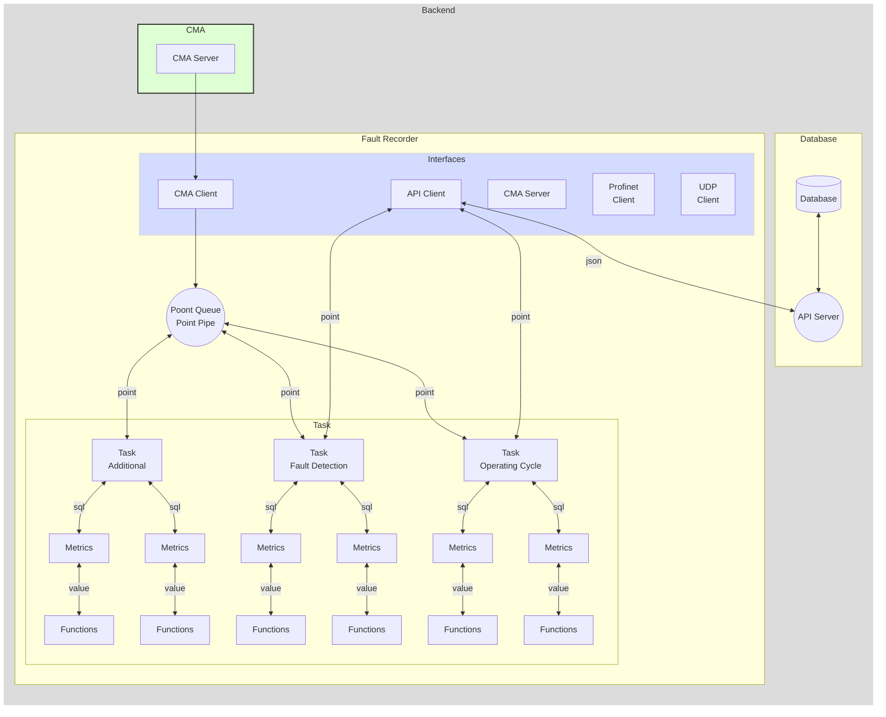

# CMA Server

## Fault Recorder Service

- receives data points from the CMA server
- stores number of configured metrics into the database

### Storeing following information into the API Server

- operating cycle
  - start timestamp
  - stop timestamp
  - alarm class
  - avarage load
  - max load

- operating cycle metrics
  - list of all metrics...
  - to be added...

- process metrics
  - process values
  - faults values

### CMA Data Server

#### Function diagram



#### Configuration fo the tasks, metrics, functions

<details>
    <summary>...</summary>

```yaml
service CmaClient:
    addres: 127.0.0.1:8881  # Self local addres
    cycle: 1 ms             # operating cycle time of the module
    auth:                   # some auth credentials
    in queue in-queue:
        max-length: 10000
    out queue: MultiQueue.in-queue

service ProfinetClient Ied01:
    cycle: 1 ms          # read cycle time, 0 or ommit to disable
    in queue in-queue:
        max-length: 10000
    out queue: MultiQueue.in-queue
    protocol: 'profinet'
    description: 'S7-IED-01'
    ip: '192.168.100.243'
    rack: 0
    slot: 1
    diagnosis:                  # internal diagnosis, delete to disable
        point Status:           # Ok(0) / Invalid(10)
            type: 'Int'
            # history: r
        point Connection:       # Ok(0) / Invalid(10)
            type: 'Int'
            # history: r    
    db db899:                   # many DB blocks allowed, name must be unique
        description: 'db899 | Exhibit - drive data'
        number: 899
        offset: 0
        size: 8
        point Drive.Speed: 
            type: 'Real'
            offset: 0
        point Drive.OutputVoltage: 
            type: 'Real'
            offset: 4
    db db999:                   # many DB blocks allowed, name must be unique
        description: 'db899 | Exhibit - drive data'
        number: 899
        offset: 0
        size: 6
        point Drive.positionFromHoist: 
            type: 'Real'
            offset: 0
        point Capacitor.Capacity: 
            type: 'Int'
            offset: 4

service ProfinetClient Ied02:
    cycle: 1 ms          # read cycle time, 0 or ommit to disable
    in queue in-queue:
        max-length: 10000
    out queue: MultiQueue.in-queue
    protocol: 'profinet'
    description: 'S7-IED-02'
    ip: '192.168.100.243'
    rack: 0
    slot: 1
    diagnosis:                  # internal diagnosis, delete to disable
        point Status:           # Ok(0) / Invalid(10)
            type: 'Int'
            # history: r
        point Connection:       # Ok(0) / Invalid(10)
            type: 'Int'
            # history: r    
    db db899:                   # many DB blocks allowed, name must be unique
        description: 'db899 | Exhibit - drive data'
        number: 899
        offset: 0
        size: 34
        point ChargeIn.On: 
            type: 'Bool'
            offset: 30
            bit: 0
        point ChargeOut.On: 
            type: 'Bool'
            offset: 32
            bit: 0


service ApiClient:
    cycle: 1 ms
    reconnect: 1 s  # default 3 s
    address: 127.0.0.1:8080
    in queue api-link:
        max-length: 10000
    out queue: MultiQueue.in-queue

service MultiQueue:
    in queue in-queue:
        max-length: 10000
    out queue:
        - task1.recv-queue
        - CmaClient.in-queue
        - CmaServer.in-queue

service Task CoreTask:
    cycle: 1 ms
    in queue api-link:
        max-length: 10000

    fn ToMultiQueue:            # points will be produced to the MultiQueue
        point CraneMovement.BoomDown:
            type: 'Int'
            offset: 14
            comment: 'Индикация опускания рукояти'
            input:
                const real 0.05


service Task OperatingCycle:
    cycle: 500 ms       # operating cycle time of the task
    in queue api-link:
        max-length: 10000

    fn ToApiQueue:              # Metric 1
        queue: api-queue
        input fn SqlMetric:
            initial: 0.123      # начальное значение
            table: table_name
            sql: "insert into {table} (id, value, timestamp) values ({id}, {input.value}, {input3.value});"
            input let Var3:
                    input fn add:
                        input1 fn add:
                            input1: const real 0.2
                            input2: point real '/path/Point.Name'
                        input2:
                            const real 0.05
            input3 fn add:
                input1:
                    var0
                input2: point real '/path/Point.Name'

    fn ToApiQueue:              # Metric 2
        queue: api-queue
        input fn SqlMetric:
            initial: 0.123      # начальное значение
            table: table_name
            sql: "insert into {table} (id, value, timestamp) values ({id}, {input.value}, {input3.value});"
            input: point real '/path/Point.Name'

    fn ToApiQueue:              # Metric 3
        queue: api-queue
        input fn SqlMetric:
            initial: 0.123      # начальное значение
            table: table_name
            sql: "insert into {table} (id, value, timestamp) values ({id}, {input.value}, {input3.value});"
            input fn or:
                input1: point real '/path/Point.Name1'
                input1: point real '/path/Point.Name2'
                input1: point real '/path/Point.Name3'

service Task FaultDetection:
    cycle: 100 ms       # operating cycle time of the module
    outputQueue: operatingCycleQueue
    fn ToApiQueue:              # Metric 1
        input1: ...
            ...
        input2: ...
            ...
```

</details>

#### Complit configuration example

<details>
    <summary>...</summary>

```yaml
name: ApplicationName
description: Short explanation / purpose etc.

service MultiQueue:
    in queue in-queue:
        max-length: 10000
    out queue:
        - TaskTestReceiver.queue

service Task Task1:
    cycle: 1 ms
    in queue recv-queue:
        max-length: 10000
    let var0: 
        input: const real 2.224

    fn ToMultiQueue:
        in1 point CraneMovement.BoomUp: 
            type: 'Int'
            comment: 'Some indication'
            input fn add:
                input1 fn add:
                    input1: const real 0.2
                    input2: point real '/path/Point.Name'
        in2 point CraneMovement.BoomDown: 
            type: 'real'
            history: r
            comment: 'Some indication'
            input: const real 0.07

        in3 point CraneMovement.WinchUp: 
            type: 'real'
            history: r
            comment: 'Some indication'
            input: var0

service ApiClient:
    cycle: 1 ms
    reconnect: 1 s  # default 3 s
    address: 127.0.0.1:8080
    database: test_api_query
    in queue api-link:
        max-length: 10000
    out queue: MultiQueue.queue
    auth_token: 123!@#
    # debug: true

service TcpServer:
    cycle: 1 ms
    reconnect: 1 s  # default 3 s
    address: {}
    auth: none      # auth: none / auth-secret: pass: ... / auth-ssh: path: ...
    in queue link:
        max-length: 10000
    out queue: MultiQueue.in-queue

service TcpClient:
    cycle: 1 ms
    reconnect: 1 s  # default 3 s
    address: 127.0.0.1:8080
    in queue link:
        max-length: 10000
    out queue: MultiQueue.queue

service ProfinetClient Ied01:
    cycle: 1 ms                         # operating cycle time of the module, if 0 or ommited, module read cycle will be disable
    in queue in-queue:
        max-length: 10000
    out queue: MultiQueue.in-queue
    # name Ied01:                       # device will be executed in the independent thread, must have unique name
    protocol: 'profinet'
    description: 'S7-IED-01'
    ip: '192.168.100.243'
    rack: 0
    slot: 1
    diagnosis:                          # internal diagnosis, delete/comment to disable
        point Status:                   # Ok(0) / Invalid(10)
            type: 'Int'
            # history: r
        point Connection:               # Ok(0) / Invalid(10)
            type: 'Int'
            # history: r    
    db db899:                       # multiple DB blocks are allowed, must have unique namewithing parent device
        # description: 'db899 | Exhibit - drive data'
        number: 899
        offset: 0
        size: 34
        point Drive.Speed: 
            type: 'Real'
            offset: 0
        point Drive.OutputVoltage: 
            type: 'Real'
            offset: 4
        point Drive.DCVoltage: 
            type: 'Real'
            offset: 8
        point Drive.Current: 
            type: 'Real'
            offset: 12
            history: r
        point Drive.Torque: 
            type: 'Real'
            offset: 16
    db db999:                       # multiple DB blocks are allowed, must have unique namewithing parent device
        description: 'db899 | Exhibit - drive data'
        number: 899
        offset: 0
        size: 34
        point Drive.positionFromMru: 
            type: 'Real'
            offset: 20
        point Drive.positionFromHoist: 
            type: 'Real'
            offset: 24
        point Capacitor.Capacity: 
            type: 'Int'
            offset: 28
        point ChargeIn.On: 
            type: 'Bool'
            offset: 30
            bit: 0
        point ChargeOut.On: 
            type: 'Bool'
            offset: 32
            bit: 0

service ProfinetClient Ied02:
    cycle: 1 ms                         # operating cycle time of the module, if 0 or ommited, module read cycle will be disable
    in queue in-queue:
        max-length: 10000
    out queue: MultiQueue.in-queue
    name Ied02:                       # device will be executed in the independent thread, must have unique name
    protocol: 'profinet'
    description: 'S7-IED-02'
    ip: '192.168.100.243'
    rack: 0
    slot: 1
    diagnosis:                          # internal diagnosis, delete/comment to disable
        point Status:                   # Ok(0) / Invalid(10)
            type: 'Int'
            # history: r
        point Connection:               # Ok(0) / Invalid(10)
            type: 'Int'
            # history: r
    db db899:                       # multiple DB blocks are allowed, must have unique namewithing parent device
        description: 'db899 | Exhibit - drive data'
        number: 899
        offset: 0
        size: 34
        point Drive.Speed: 
            type: 'Real'
            offset: 0
        point Drive.OutputVoltage: 
            type: 'Real'
            offset: 4
        point Drive.DCVoltage: 
            type: 'Real'
            offset: 8
        point Drive.Current: 
            type: 'Real'
            offset: 12
        point Drive.Torque: 
            type: 'Real'
            offset: 16
        point Drive.positionFromMru: 
            type: 'Real'
            offset: 20
        point Drive.positionFromHoist: 
            type: 'Real'
            offset: 24
        point Capacitor.Capacity: 
            type: 'Int'
            offset: 28
        point ChargeIn.On: 
            type: 'Bool'
            offset: 30
            bit: 0
        point ChargeOut.On: 
            type: 'Bool'
            offset: 32
            bit: 0
```

</details>

#### Point

The Entity of the information. Contains fallowing:

- name
- type
- value
- status
- cot
- timestamp

<details>
    <summary>...</summary>

##### Point.name

Unique within all the system (similar to the linux system full file path).

- Begins with "/",
- consists of the path divided by the "/",
- Ends with the name (name can be divided by the dot / multiple dots)

Examples:

```js
'/AppName/Service/Point.Name'
'/AppName/Device/Point.Name'
'/AppName/SubAppName/Device/Point.Name'
```

##### Point.type

The type of the containing information stored in the Point.value field. Fallowing types are supported:

- Bool - true / false
- Int - i64 - The 64-bit signed integer type.
- Real - f32 - A 32-bit floating point type (specifically, the "binary32" type defined in IEEE 754-2008).
- Double - f64 - A 64-bit floating point type (specifically, the "binary64" type defined in IEEE 754-2008).
- String - string of the variable length

##### Point.value

Contains the information of the type corresponding with the Point.type field

##### Point.status

The status of the containing information:

- Ok = 0 - Information was successfully updated from the source device;
- Obsolete = 2 - For example system was jast started and information stored from the prevouse session;
- TimeInvalid = 3 - The time of the server / Device is not synchronized with precision time source;
- Invalid = 10 - Information was read from the device but currently connection with that device is lost;

##### Point.cot

Cause and direction of the transmission:

- Inf - Information - common information basically comming from the Device / Server to the Client
- Act - Activation - the command comming from the Client to the Device / Server
- ActCon - Activation | Confirmation - the confirmation of the successfully executed command
- ActErr - Activation | Error - the information about falied command
- Req - Request - the request to the server, besicaly contains some specific json
- ReqCon - Request | Confirmation reply - the confirmation of the successfully performed request
- ReqErr - Request | Error reply - the information about falied request

##### Point.timestamp

Contains a timestamp in the format corresponding with RFC 3339 and ISO 8601 date and time string:

- Includes milliseconds and microseconds,
- Local time zone offset can be included

Such as:
`2024-02-19T12:16:57.648504907Z`

</details>

#### PointConfig

```yaml
    Point.Name:
        type: Bool                  # Bool / Int / Real / Double / String / Json
        alarm: 0                    # 0..15 (Optional)
        history: r                  # ommit - None / r - Read / w - Write / rw - ReadWrite (Optional)
        address:                    # Protocol-specific address in the source device (Optional)
            offset: 0               #   0..65535
            bit: 0                  #   0..255 (Optional)
        filters:                    # Filter conf, using such filter, point can be filtered immediately after input's parser
            threshold: 5.0          #   Absolute threshold delta
            factor: 0.1             #   Multiplier for absolute threshold delta - in this case the delta will be accumulated
        comment: Test Point Bool,   # Description to the point (Optional)
```

<details>
    <summary>...</summary>

##### PointConfig.type

The type of the containing information stored in the Point.value field.
Corresponding with Point.Value.
Fallowing types are supported:

- Bool - true / false
- Int - i64 - The 64-bit signed integer type.
- Real - f32 - A 32-bit floating point type (specifically, the "binary32" type defined in IEEE 754-2008).
- Double - f64 - A 64-bit floating point type (specifically, the "binary64" type defined in IEEE 754-2008).
- String - string of the variable length
- Json - coming soon

##### PointConfig.alarm

The alarm class of the point, determains how it will be shown in the Alarm List of the Client application:

- 0 - alarm disabled (can be omitted)
- 1 - Emergency Alarm (State when equipment can't work anymore)
- 2 - Not in use (Sub class of Emergency Alarm)
- 3 - Not in use (Sub class of Emergency Alarm)
- 4 - Warning (Important events to pay attention)
- 5 - Not in use
- 6 - Not in use
- 7 - Not in use
- 8 - Not in use
- 9 - Not in use
- 10 - Not in use
- 11 - Not in use
- 12 - Not in use
- 13 - Not in use
- 14 - Not in use
- 15 - Not in use

##### PointConfig.history

Point config history option, determines for which direction will be enabled history option:

- None - history parameter was omitted / deactivated
- r / read / Read - history parameter active for points coming from devicec to the clients
- w / write / Write - history parameter active for points (commands) coming from clients to the devices
- rw / readwrite / ReadWrite - history parameter active for points & points (commands) both directions

##### PointConfig.address

General implementation of the PointConfig.address
For specific protocols can have custom implementations

```yaml
    address:                    # Protocol-specific address in the source device (Optional)
        offset: 0               # 0..65535 - Some address / ofset withing the device
        bit: 0                  # 0..255 (Optional) - can be used for boolean bits stored in some address / offset
```

##### PointConfig.filters

Sequence of the prefilters - executed during parsing data points from the protocol line
Allows to avoid unnecessary transmissions of the same value

- threshold - float insensitivity parameter to the absolute changes of the value,  
    1).
    $$delta = \mid value_i - value_{i-1}\mid;$$
    2).
    $$delta > threshold :\quad value updated$$
    $$delta \leq threshold :\quad value ignored$$

- factor - integral factor, if present:  
    1).
    $$delta = delta_{i-1} + \mid (value_i - value_{i-1})\mid factor;$$
    2).
    $$delta > threshold :\quad value updated$$
    $$delta \leq threshold :\quad value ignored$$

</details>

#### JDS Protocol

<details>
    <summary>...</summary>

##### Request "Points"

- Req

```json
{
    "type":"String",    Bool / Int / Real/ Double / String
    "value":"",
    "name":"/App/Jds/Points",
    "status":0,
    "cot":"Req",    Inf / Act / ActCon / ActErr / Req / ReqCon / ReqErr
    "timestamp":"2024-03-11T14:33:19.510314994+00:00"
}
```

- ReqCon

```json
{
    "type":"String",    Bool / Int / Real / Double / String
    "value":"{
        "Point.Name.0":{"address":{"bit":0,"offset":0},"alarm":0,"comment":"Test Point Bool","filters":{"threshold":5.0},"type":"Bool"},
        "Point.Name.1":{"address":{"bit":0,"offset":0},"alarm":0,"comment":"Test Point Bool","filters":{"factor":0.1,"threshold":5.0},"type":"Bool"},
        "PointName1":{"address":{"offset":0},"comment":"Test Point","history":"r","type":"Int"},
        "PointName2":{"address":{"offset":0},"alarm":4,"comment":"Test Point","type":"Int"},
        "PointName3":{"address":{"offset":12},"comment":"Test Point","history":"w","type":"Int"},
        "PointName4":{"address":{"offset":12},"comment":"Test Point","history":"rw","type":"Int"}
    }",
    "name":"/App/Jds/Points",
    "status":0,
    "cot":"RecCon",    Inf / Act / ActCon / ActErr / Req / ReqCon / ReqErr
    "timestamp":"2024-03-11T14:33:19.510314994+00:00"
}
```

- ReqErr

```json
{
    "type":"String",    Bool / Int / Real / Double / String
    "value":"",
    "name":"/App/Jds/Points",
    "status":0,
    "cot":"ReqErr",    Inf / Act / ActCon / ActErr / Req / ReqCon / ReqErr
    "timestamp":"2024-03-11T14:33:19.510314994+00:00"
}
```

##### Request "Subscribe"

- Req

```json
{
    "type":"String",    Bool / Int / Real / Double / String
    "value":"[]",
    "name":"/App/Jds/Subscribe",
    "status":0,
    "cot":"Req",    Inf / Act / ActCon / ActErr / Req / ReqCon / ReqErr
    "timestamp":"2024-03-11T14:33:19.510314994+00:00"
}
```

- ReqCon

```json
{
    "type":"String",    Bool / Int / Real / Double / String
    "value":"",
    "name":"/App/Jds/Subscribe",
    "status":0,
    "cot":"RecCon",    Inf / Act / ActCon / ActErr / Req / ReqCon / ReqErr
    "timestamp":"2024-03-11T14:33:19.510314994+00:00"
}
```

ReqErr

```json
{
    "type":"String",    Bool / Int / Real / Double / String
    "value":"",
    "name":"/App/Jds/Subscribe",
    "status":0,
    "cot":"ReqErr",    Inf / Act / ActCon / ActErr / Req / ReqCon / ReqErr
    "timestamp":"2024-03-11T14:33:19.510314994+00:00"
}
```

</details>

#### ProfinetClient

Service provides connectivity with S7 Siemens deviceы via Profinet protocol over ethernet

- Read from Profinet - only periodic read of data blocks

- Write to Profinet - implemented in the separate thread
    with independent tcp connection, wich is allow to send
    commands immediatelly, no need to wait complition read cycle

- Configuration
  - cycle - read cycle, readind disabled if zero or ommited
  - subscribe - Enables the subscription where from commands
  will be received, for subscribe configuration
  refer to [doc](src/conf/conf_subscribe.rs) for details
  - in queue - Enables direct input queue,
  define the name of the input queue and queue length limitation
  - send-to - (old: out queue) The name of the input queue of the service,
  where all points will be sent such as 'ServiceName.in-queue'
  - protocol - 'profinet' - always, reserved for protocol options
  - description - Free text description
  - ip - The IPV4 address
  - rack - rack address configured in the S7 device
  - clot - slot address configured in the S7 device
  - diagnosis - Specific diagnosis points can be enabled by definition of it configurations
    - General status
      - Ok(0) - service in normal operation
      - Invalid(10) - service has some Error-level events
    - Connection status
      - Ok(0) - subordinated Profinet device connected
      - Invalid(10) - subordinated Profinet device is disconnected
  - db db_name - The definition of the S7 DB block configuration
    - number - The address number of the DB block
    - offset - initial address offset
    - size of the entair block (last address + it length)
    - point Point.Name - The point configuration
      - type: data type of it address
      - address
        - offset - point value will be read from address: db block offset + point offset
        - bit - applicable for bool type only, defines number of the bit in the current offset
        - history - refer to the [doc](src/conf/point_config/point_config.rs)
        - alarm - refer to the [doc](src/conf/point_config/point_config.rs)
        - filters - refer to the [doc](src/conf/point_config/point_config.rs)
        - comment - refer to the [doc](src/conf/point_config/point_config.rs)


<details>
    <summary>Config example</summary>

```yaml
service ProfinetClient Ied01:
    cycle: 500 ms                         # operating cycle time of the module
    # in queue in-queue:
        # max-length: 10000
    subscribe: MultiQueue
    out queue: MultiQueue.in-queue
    protocol: 'profinet'
    description: 'S7-IED-01'
    ip: '192.168.130.243'
    rack: 0
    slot: 1
    diagnosis:                          # internal diagnosis
        point Status:                   # Ok(0) / Invalid(10)
            type: 'Int'
            # history: r
        point Connection:               # Ok(0) / Invalid(10)
            type: 'Int'
            # history: r
    db db_name:                         # multiple DB blocks are allowed, must have unique namewithing parent device
        # description: 'db899 | Exhibit - drive data'
        number: 899
        offset: 0
        size: 34
        point Drive.Speed: 
            type: 'Real'
            address:
                offset: 0
        point Drive.OutputVoltage: 
            type: 'Real'
            address:
                offset: 4
    db db_name_:                        # multiple DB blocks are allowed, must have unique namewithing parent device
        description: 'db899 | Exhibit - drive data'
        number: 899
        offset: 0
        size: 34
        cycle: 10 ms
        point Capacitor.Capacity: 
            type: 'Int'
            address:
                offset: 28
        point Capacitor.ChargeIn.On: 
            type: 'Bool'
            address:
                offset: 30
                bit: 0
        point Capacitor.ChargeOut.On: 
            type: 'Bool'
            address:
                offset: 32
                bit: 0
```

</details>
