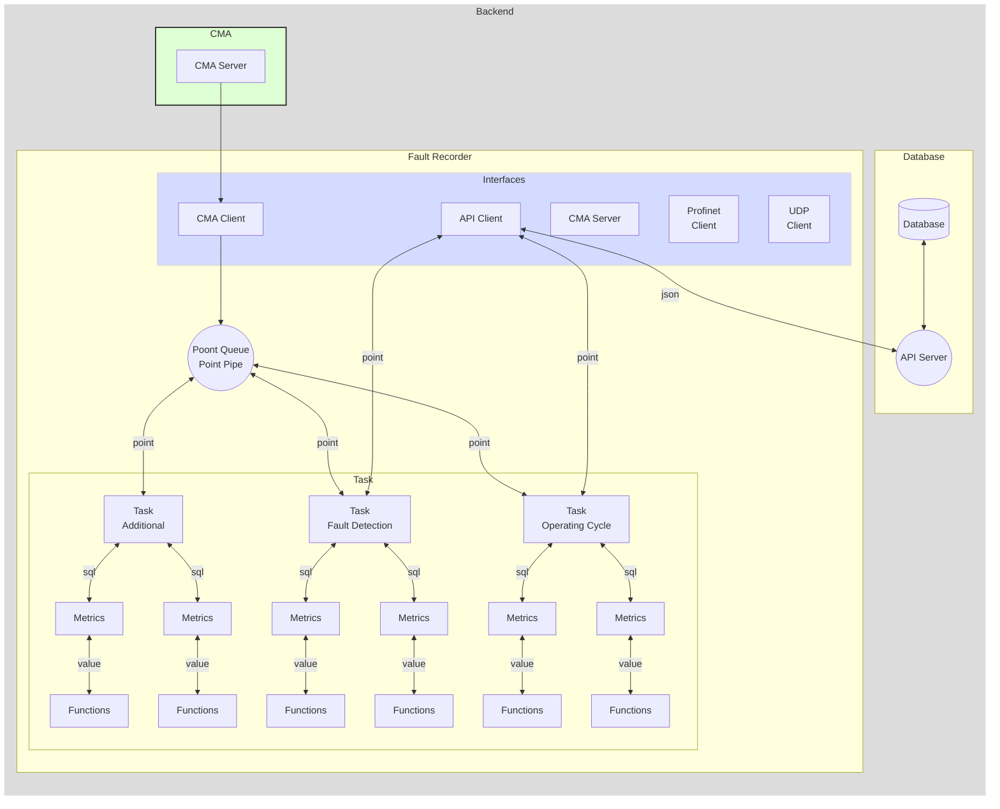

# Fault Recorder Service

- receives data points from the CMA server
- stores number of configured metrics into the database

#### Storeing following information into the API Server

- operating cycle
  - start timestamp
  - stop timestamp
  - alarm class
  - avarage load
  - max load

- operating cycle metrics
  - list of all metrics...
  - to be added...

- process metrics
  - process values
  - faults values

#### Function diagram



#### Configuration fo the tasks, metrics, functions

```yaml
service CmaClient:
    addres: 127.0.0.1:8881  # Self local addres
    cycle: 1 ms             # operating cycle time of the module
    auth:                   # some auth credentials
    in queue in-queue:
        max-length: 10000
    out queue: MultiQueue.in-queue

service ProfinetClient Ied01:
    cycle: 1 ms                         # operating cycle time of the module
    in queue in-queue:
        max-length: 10000
    out queue: MultiQueue.in-queue
    # name Ied01:                       # device will be executed in the independent thread, must have unique name
    protocol: 'profinet'
    description: 'S7-IED-01'
    ip: '192.168.100.243'
    rack: 0
    slot: 1
    db db899:                       # multiple DB blocks are allowed, must have unique namewithing parent device
        description: 'db899 | Exhibit - drive data'
        number: 899
        offset: 0
        size: 8
        delay: 10
        point Drive.Speed: 
            type: 'Real'
            offset: 0
        point Drive.OutputVoltage: 
            type: 'Real'
            offset: 4
    db db999:                       # multiple DB blocks are allowed, must have unique namewithing parent device
        description: 'db899 | Exhibit - drive data'
        number: 899
        offset: 0
        size: 6
        delay: 10
        point Drive.positionFromHoist: 
            type: 'Real'
            offset: 0
        point Capacitor.Capacity: 
            type: 'Int'
            offset: 4

service ProfinetClient Ied02:
    cycle: 1 ms                         # operating cycle time of the module
    in queue in-queue:
        max-length: 10000
    out queue: MultiQueue.in-queue
    name Ied02:                       # device will be executed in the independent thread, must have unique name
    protocol: 'profinet'
    description: 'S7-IED-02'
    ip: '192.168.100.243'
    rack: 0
    slot: 1
    db db899:                       # multiple DB blocks are allowed, must have unique namewithing parent device
        description: 'db899 | Exhibit - drive data'
        number: 899
        offset: 0
        size: 34
        delay: 10
        point ChargeIn.On: 
            type: 'Bool'
            offset: 30
            bit: 0
        point ChargeOut.On: 
            type: 'Bool'
            offset: 32
            bit: 0


service ApiClient:
    cycle: 1 ms
    reconnect: 1 s  # default 3 s
    address: 127.0.0.1:8080
    in queue api-link:
        max-length: 10000
    out queue: MultiQueue.in-queue

service MultiQueue:
    in queue in-queue:
        max-length: 10000
    out queue:
        - task1.recv-queue
        - CmaClient.in-queue
        - CmaServer.in-queue

task CoreTask:
    cycle: 1 ms
    in queue api-link:
        max-length: 10000

    fn ToMultiQueue:            # points will be produced as regular Points to the MultiQueue
        point CraneMovement.BoomDown:           # /AppName/CoreTask/CraneMovement.BoomDown
            type: 'Int'
            offset: 14
            comment: 'Индикация опускания рукояти'
            input:
                const float 0.05


task OperatingCycle:
    cycle: 500 ms       # operating cycle time of the task
    in queue api-link:
        max-length: 10000

    fn ToApiQueue:              # Metric 1
        queue: api-queue
        input fn SqlMetric:
            initial: 0.123      # начальное значение
            table: table_name
            sql: "insert into {table} (id, value, timestamp) values ({id}, {input.value}, {input3.value});"
            input let Var3:
                    input fn add:
                        input1 fn add:
                            input1: const float 0.2
                            input2: point float '/path/Point.Name'
                        input2:
                            const float 0.05
            input3 fn add:
                input1:
                    var0
                input2: point float '/path/Point.Name'

    fn ToApiQueue:              # Metric 2
        queue: api-queue
        input fn SqlMetric:
            initial: 0.123      # начальное значение
            table: table_name
            sql: "insert into {table} (id, value, timestamp) values ({id}, {input.value}, {input3.value});"
            input: point float '/path/Point.Name'

    fn ToApiQueue:              # Metric 3
        queue: api-queue
        input fn SqlMetric:
            initial: 0.123      # начальное значение
            table: table_name
            sql: "insert into {table} (id, value, timestamp) values ({id}, {input.value}, {input3.value});"
            input fn or:
                input1: point float '/path/Point.Name1'
                input1: point float '/path/Point.Name2'
                input1: point float '/path/Point.Name3'

task FaultDetection:
    cycle: 100 ms       # operating cycle time of the module
    outputQueue: operatingCycleQueue
    fn ToApiQueue:              # Metric 1
        input1: ...
            ...
        input2: ...
            ...
```

#### Complit configuration example

<details>

```yaml
server:
    net: TCP                # TCP/UDP
    protocol:               # CMA-Json / CMA-Byte
    addres: 127.0.0.1:8882  # Self local addres
    cycle: 100 ms           # operating cycle time of the module
    in:
        queue dataCacheQueue:
            max-length: 10000
    out:
client API:
    addres: 127.0.0.1:8080  # Self local addres
    cycle: 100 ms           # operating cycle time of the module
    auth:                   # some auth credentials
    in:
        queue operatingCycleQueue:
            max-length: 10000
        queue faultDetectionQueue:
            max-length: 10000
    out:
data-cache:
    client CMA:
        addres: 127.0.0.1:8881  # Self local addres
        cycle: 100 ms           # operating cycle time of the module
        auth:                   # some auth credentials
        in:
        out:
tasks:
    task OperatingCycle:
        cycle: 500 ms       # operating cycle time of the task
        outputQueue: operatingCycleQueue
        metrics:
            fn MetricName1:
                initial: 0      # начальное значение
                input: 
                    var VarName1:
                        fn count:
                            input: 
                                - /line1/ied1/db1/Dev1.State
            fn MetricName2:
                initial: 0      # начальное значение
                input: 
                    var VarName2:
                        fn timer:
                            initial: VarName1
                            input:
                                fn or:
                                    input: 
                                        - /line1/ied1/db1/Dev2.State
                                        - /line1/ied1/db1/Dev3.State
                                        - /line1/ied1/db1/Dev4.State
    task FaultDetection:
        cycle: 100 ms       # operating cycle time of the module
        outputQueue: operatingCycleQueue
        metrics:
            fn MetricName1:
                ...
            fn MetricName2:
                ...
```

</details>
Given configuration creates following classes

```JS
inputs = {
    '/line1/ied1/db1/Dev1.State': FnInput{}
    '/line1/ied1/db1/Dev2.State': FnInput{}
    '/line1/ied1/db1/Dev3.State': FnInput{}
    '/line1/ied1/db1/Dev4.State': FnInput{}
}
outs = {
    'VarName1': FnOut{
        input: FnCount{
            input: '/line1/ied1/db1/Dev1.State'
        },
    },
    'VarName2': FnOut{
        input: FnTimer{
            input: FnOr{
                input: '/line1/ied1/db1/Dev2.State'
                input: '/line1/ied1/db1/Dev3.State'
                input: '/line1/ied1/db1/Dev4.State'
            },
        },
    },
}
metrics = {
    'MetricName1': Metric{
        id: 'MetricName1',
        input: VarName1,
    },
    'MetricName2': Metric{
        id: 'MetricName1',
        input: VarName2,
    },
}
```

#### Point

The Entity of the information. Contains fallowing:

- name
- type
- value
- status
- cot
- timestamp

<details>

##### Point.name

Unique within all the system (similar to the linux system full file path).

- Begins with "/",
- consists of the path divided by the "/",
- Ends with the name (name can be divided by the dot / multiple dots)

Examples:

```js
'/AppName/Service/Point.Name'
'/AppName/Device/Point.Name'
'/AppName/SubAppName/Device/Point.Name'
```

##### Point.type

The type of the containing information stored in the Point.value field. Fallowing types are supported:

- Bool - true / false
- Int - i64 - The 64-bit signed integer type.
- Float - f64 - A 64-bit floating point type (specifically, the "binary64" type defined in IEEE 754-2008).
- String - string of the variable length

##### Point.value

Contains the information of the type corresponding with the Point.type field

##### Point.status

The status of the containing information:

- Ok = 0 - Information was successfully updated from the source device;
- Obsolete = 2 - For example system was jast started and information stored from the prevouse session;
- TimeInvalid = 3 - The time of the server / Device is not synchronized with precision time source;
- Invalid = 10 - Information was read from the device but currently connection with that device is lost;

##### Point.cot

Cause and direction of the transmission:

- Inf - Information - common information basically comming from the Device / Server to the Client
- Act - Activation - the command comming from the Client to the Device / Server
- ActCon - Activation | Confirmation - the confirmation of the successfully executed command
- ActErr - Activation | Error - the information about falied command
- Req - Request - the request to the server, besicaly contains some specific json
- ReqCon - Request | Confirmation reply - the confirmation of the successfully performed request
- ReqErr - Request | Error reply - the information about falied request

##### Point.timestamp

Contains a timestamp in the format corresponding with RFC 3339 and ISO 8601 date and time string:

- Includes milliseconds and microseconds,
- Time zone can be included

Such as:
`2024-02-19T12:16:57.648504907Z`

##### PointConfig

</details>
