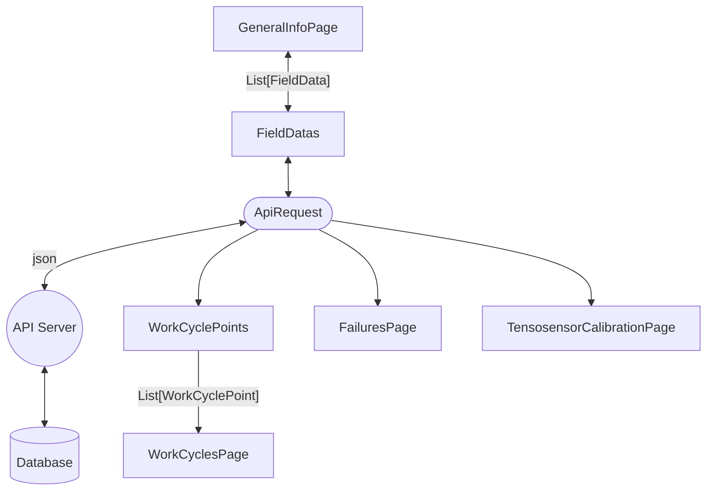

# Fault Recorder Service 

#### Storeing following information into the API Server:
- operating cycle
- operating cycle metrics
- process metrics

#### Function diagram:


math task functions configuration:
```yaml
let VarName1:
   input: fn functionName:
      initial: point '/path/Point.Name/'

let VarName2:
   input: fn functionName:
      initial: VarName1
      input: functionName:
         input1: const someValue
         input2: point '/path/Point.Name/'
         input: fn functionName:
            input: point '/path/Point.Name/'
...
```