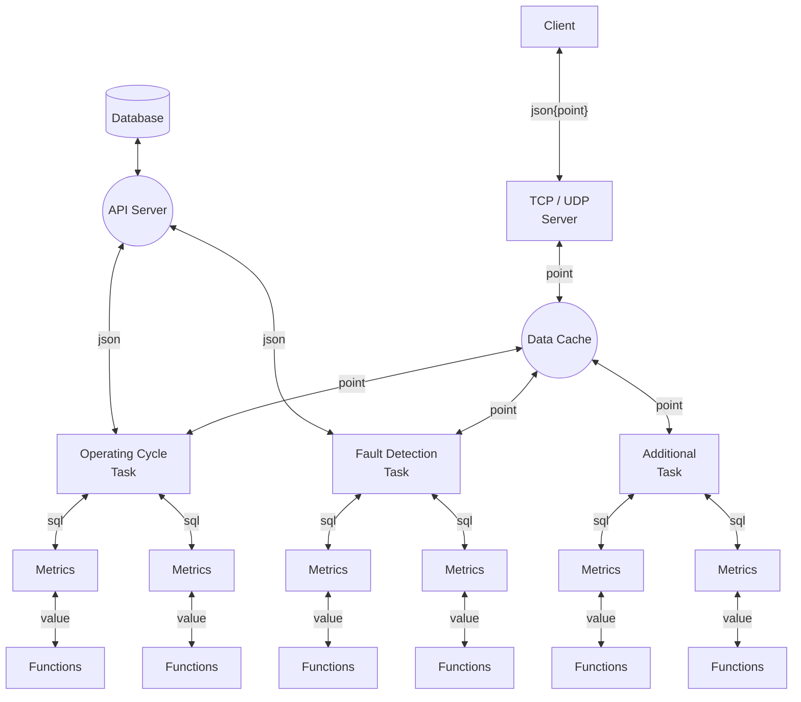

# Fault Recorder Service 

#### Storeing following information into the API Server:
- operating cycle
- operating cycle metrics
- process metrics

#### Function diagram:


math task functions configuration:
```yaml
let VarName1:
   input: fn functionName:
      initial: point '/path/Point.Name/'

let VarName2:
   input: fn functionName:
      initial: VarName1
      input: functionName:
         input1: const someValue
         input2: point '/path/Point.Name/'
         input: fn functionName:
            input: point '/path/Point.Name/'
...
```

```yaml
MetricName1
    default: 0      # начальное значение
    input: 
        var VarName1:
            fn count:
                input: 
                    - /line1/ied1/db1/Dev1.State

MetricName2
    default: 0      # начальное значение
    input: 
        var VarName2:
            fn timer:
                initial: VarName1
                input:
                    fn or:
                        input: 
                            - /line1/ied1/db1/Dev2.State
                            - /line1/ied1/db1/Dev3.State
                            - /line1/ied1/db1/Dev4.State
```

Given configuration creates following classes
```JS
inputs = {
    '/line1/ied1/db1/Dev1.State': FnInput{}
    '/line1/ied1/db1/Dev2.State': FnInput{}
    '/line1/ied1/db1/Dev3.State': FnInput{}
    '/line1/ied1/db1/Dev4.State': FnInput{}
}
outs = {
    'VarName1': FnOut{
        input: FnCount{
            input: '/line1/ied1/db1/Dev1.State'
        },
    },
    'VarName2': FnOut{
        input: FnTimer{
            input: FnOr{
                input: '/line1/ied1/db1/Dev2.State'
                input: '/line1/ied1/db1/Dev3.State'
                input: '/line1/ied1/db1/Dev4.State'
            },
        },
    },
}
metrics = {
    'MetricName1': Metric{
        id: 'MetricName1',
        input: VarName1,
    },
    'MetricName2': Metric{
        id: 'MetricName1',
        input: VarName2,
    },
}
```