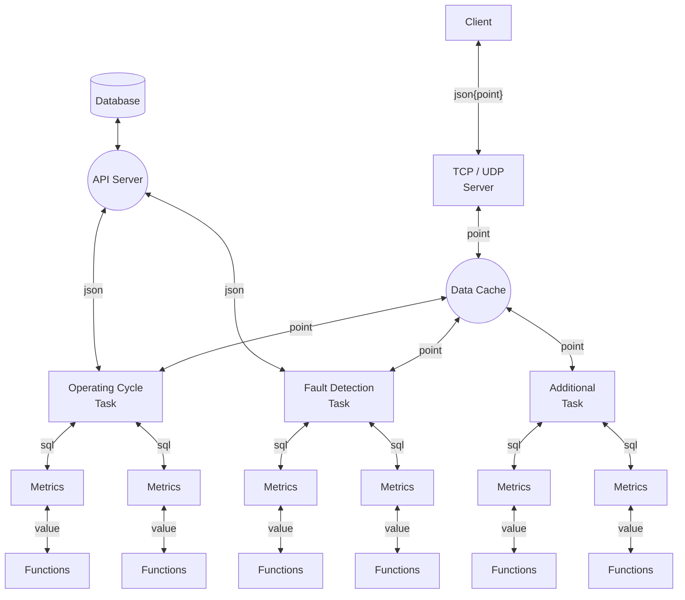

# Fault Recorder Service

- receives data points from the CMA server
- stores number of configured metrics into the database

#### Storeing following information into the API Server

- operating cycle
  - start timestamp
  - stop timestamp
  - alarm class
  - avarage load
  - max load

- operating cycle metrics
  - list of all metrics...
  - to be added...

- process metrics
  - process values
  - faults values

#### Function diagram



#### Configuration fo the tasks, metrics, functions

```yaml
server:
    net: TCP            // TCP/UDP
    protocol:           // CMA-Json / CMA-Byte
    addres: 127.0.0.1   // Self local addres
tasks:
    task OperatingCycle:
        cycle: 500 ms
        metrics:
            metric MetricName1:
                initial: 0      # начальное значение
                input: 
                    var VarName1:
                        fn count:
                            input: 
                                - /line1/ied1/db1/Dev1.State
            metric MetricName2:
                initial: 0      # начальное значение
                input: 
                    var VarName2:
                        fn timer:
                            initial: VarName1
                            input:
                                fn or:
                                    input: 
                                        - /line1/ied1/db1/Dev2.State
                                        - /line1/ied1/db1/Dev3.State
                                        - /line1/ied1/db1/Dev4.State
    task FaultDetection:
        cycle: 100 ms
        metrics:
            metric MetricName1:
                ...
            metric MetricName2:
                ...
```

Given configuration creates following classes

```JS
inputs = {
    '/line1/ied1/db1/Dev1.State': FnInput{}
    '/line1/ied1/db1/Dev2.State': FnInput{}
    '/line1/ied1/db1/Dev3.State': FnInput{}
    '/line1/ied1/db1/Dev4.State': FnInput{}
}
outs = {
    'VarName1': FnOut{
        input: FnCount{
            input: '/line1/ied1/db1/Dev1.State'
        },
    },
    'VarName2': FnOut{
        input: FnTimer{
            input: FnOr{
                input: '/line1/ied1/db1/Dev2.State'
                input: '/line1/ied1/db1/Dev3.State'
                input: '/line1/ied1/db1/Dev4.State'
            },
        },
    },
}
metrics = {
    'MetricName1': Metric{
        id: 'MetricName1',
        input: VarName1,
    },
    'MetricName2': Metric{
        id: 'MetricName1',
        input: VarName2,
    },
}
```
