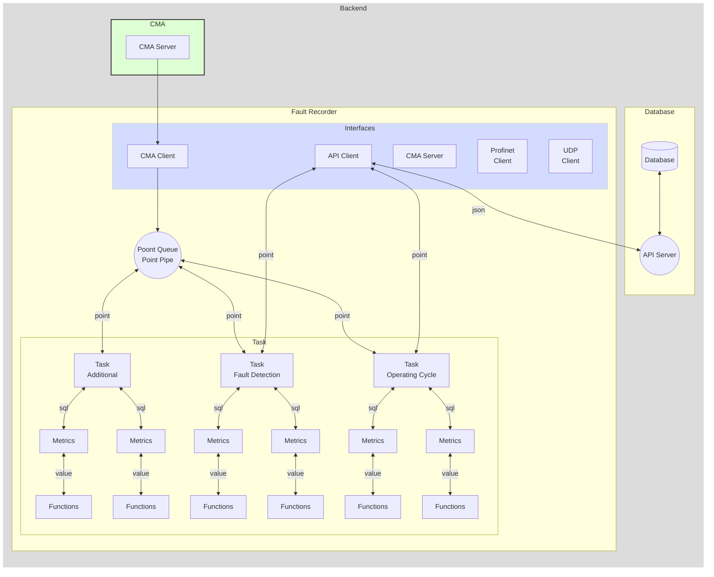

# Fault Recorder Service

- receives data points from the CMA server
- stores number of configured metrics into the database

#### Storeing following information into the API Server

- operating cycle
  - start timestamp
  - stop timestamp
  - alarm class
  - avarage load
  - max load

- operating cycle metrics
  - list of all metrics...
  - to be added...

- process metrics
  - process values
  - faults values

#### Function diagram



#### Configuration fo the tasks, metrics, functions

```yaml
service CmaClient:
    addres: 127.0.0.1:8881  // Self local addres
    cycle: 1 ms           // operating cycle time of the module
    auth:                   // some auth credentials
    in queue in-queue:
        max-length: 10000
    out queue: MultiQueuue.in-queue

service ApiClient:
    cycle: 1 ms
    reconnect: 1 s  # default 3 s
    address: 127.0.0.1:8080
    in queue api-link:
        max-length: 10000
    out queue: MultiQueuue.in-queue

service MultiQueue:
    in queue in-queue:
        max-length: 10000
    out queue:
        - task1.recv-queue
        - CmaClient.in-queue
        - CmaServer.in-queue

task OperatingCycle:
    cycle: 500 ms       // operating cycle time of the task
    outputQueue: operatingCycleQueue
    metrics:
        metric MetricName1:
            initial: 0      # начальное значение
            input: 
                var VarName1:
                    fn count:
                        input: 
                            - /line1/ied1/db1/Dev1.State
        metric MetricName2:
            initial: 0      # начальное значение
            input: 
                var VarName2:
                    fn timer:
                        initial: VarName1
                        input:
                            fn or:
                                input: 
                                    - /line1/ied1/db1/Dev2.State
                                    - /line1/ied1/db1/Dev3.State
                                    - /line1/ied1/db1/Dev4.State
task FaultDetection:
    cycle: 100 ms       // operating cycle time of the module
    outputQueue: operatingCycleQueue
    metrics:
        metric MetricName1:
            ...
        metric MetricName2:
            ...
```

#### Complit configuration example

<details>

```yaml
server:
    net: TCP                // TCP/UDP
    protocol:               // CMA-Json / CMA-Byte
    addres: 127.0.0.1:8882  // Self local addres
    cycle: 100 ms           // operating cycle time of the module
    in:
        queue dataCacheQueue:
            max-length: 10000
    out:
client API:
    addres: 127.0.0.1:8080  // Self local addres
    cycle: 100 ms           // operating cycle time of the module
    auth:                   // some auth credentials
    in:
        queue operatingCycleQueue:
            max-length: 10000
        queue faultDetectionQueue:
            max-length: 10000
    out:
data-cache:
    client CMA:
        addres: 127.0.0.1:8881  // Self local addres
        cycle: 100 ms           // operating cycle time of the module
        auth:                   // some auth credentials
        in:
        out:
tasks:
    task OperatingCycle:
        cycle: 500 ms       // operating cycle time of the task
        outputQueue: operatingCycleQueue
        metrics:
            metric MetricName1:
                initial: 0      # начальное значение
                input: 
                    var VarName1:
                        fn count:
                            input: 
                                - /line1/ied1/db1/Dev1.State
            metric MetricName2:
                initial: 0      # начальное значение
                input: 
                    var VarName2:
                        fn timer:
                            initial: VarName1
                            input:
                                fn or:
                                    input: 
                                        - /line1/ied1/db1/Dev2.State
                                        - /line1/ied1/db1/Dev3.State
                                        - /line1/ied1/db1/Dev4.State
    task FaultDetection:
        cycle: 100 ms       // operating cycle time of the module
        outputQueue: operatingCycleQueue
        metrics:
            metric MetricName1:
                ...
            metric MetricName2:
                ...
```

</details>
Given configuration creates following classes

```JS
inputs = {
    '/line1/ied1/db1/Dev1.State': FnInput{}
    '/line1/ied1/db1/Dev2.State': FnInput{}
    '/line1/ied1/db1/Dev3.State': FnInput{}
    '/line1/ied1/db1/Dev4.State': FnInput{}
}
outs = {
    'VarName1': FnOut{
        input: FnCount{
            input: '/line1/ied1/db1/Dev1.State'
        },
    },
    'VarName2': FnOut{
        input: FnTimer{
            input: FnOr{
                input: '/line1/ied1/db1/Dev2.State'
                input: '/line1/ied1/db1/Dev3.State'
                input: '/line1/ied1/db1/Dev4.State'
            },
        },
    },
}
metrics = {
    'MetricName1': Metric{
        id: 'MetricName1',
        input: VarName1,
    },
    'MetricName2': Metric{
        id: 'MetricName1',
        input: VarName2,
    },
}
```
